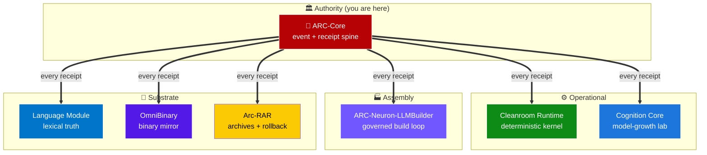

# ARC-Core

**The authoritative event-and-receipt engine for the ARC governed-AI ecosystem — a deterministic kernel for signal intelligence, entity resolution, graph state, case management, proposal workflows, geospatial overlays, and authority-gated execution.**

> Every receipt in the ARC ecosystem derives from ARC-Core's discipline. Inspired by ARC-OS (2067) from *Continuum*, built as the system-of-record layer that every other ARC repo can sign its decisions against.

<sub>**Topics**: signal intelligence · event sourcing · receipt chains · cognitive architecture · deterministic systems · case management · geospatial intelligence · FastAPI · SQLite · authority gating · ARC ecosystem · governed AI · operator console · Proto-AGI infrastructure</sub>

[](./LICENSE)
[](https://www.python.org/downloads/)
[](https://fastapi.tiangolo.com/)
[](./ARC_Console/tests)
[](./ECOSYSTEM.md)
[](./ECOSYSTEM.md)
[](https://github.com/sponsors/GareBear99)

---

## 🌐 The ARC Ecosystem

ARC-Core is **the root authority** in a seven-repo governed-AI ecosystem. Every other repo depends on the event-and-receipt discipline defined here.



### Where ARC-Core is used, and for what

| Repo | What it uses ARC-Core for |
|---|---|
| **[arc-lucifer-cleanroom-runtime](https://github.com/GareBear99/arc-lucifer-cleanroom-runtime)** | The deterministic kernel hosts its event log on ARC-Core semantics: every state transition is a proposal → evidence → receipt chain, replayable via `state_at(event_id)`. Cleanroom is where ARC-Core's discipline becomes runtime enforcement. |
| **[arc-cognition-core](https://github.com/GareBear99/arc-cognition-core)** | Every training run, benchmark result, and promotion decision in the cognition lab becomes an ARC-Core-style event. Promotion gate v1 (the lineage that became LLMBuilder's Gate v2) uses ARC-Core's authority-gating pattern for who may promote what. |
| **[ARC-Neuron-LLMBuilder](https://github.com/GareBear99/ARC-Neuron-LLMBuilder)** | Every Gate v2 promotion receipt is an ARC-Core-shaped event — candidate, incumbent, evidence, decision, SHA-256 identity. Conversation turns through the canonical pipeline are the same kind of event-with-receipt that ARC-Core pioneered. |
| **[arc-language-module](https://github.com/GareBear99/arc-language-module)** | Language absorption, self-fill, arbitration, and release snapshots all use ARC-Core's provenance-and-approval flow: proposed term → evidence (source, trust rank) → receipt → approved canon. Contradiction handling mirrors ARC-Core's dual-record discipline. |
| **[omnibinary-runtime](https://github.com/GareBear99/omnibinary-runtime)** | Binary intake / classification / execution-fabric events flow into the OBIN ledger using ARC-Core's receipt-first doctrine. Every binary operation produces a receipt *before* producing a result, mirroring ARC-Core's event-sourcing stance. |
| **[Arc-RAR](https://github.com/GareBear99/Arc-RAR)** | Archive bundles and restorable extracts are event-producing. Extraction leaves an ARC-Core-style receipt; bundle manifests carry SHA-256 identity that ARC-Core's receipt chain can verify against. |

All seven repos share one author and one funding target: [github.com/sponsors/GareBear99](https://github.com/sponsors/GareBear99).

Full per-repo integration contracts: [**ECOSYSTEM.md**](./ECOSYSTEM.md).

### And beyond the core ecosystem — consumer applications using ARC-Core

ARC-Core's discipline is also used as the authority/receipt backbone for several consumer applications, games, simulators, and commercial product backends. Each of these repos carries its own **🔐 Built on ARC-Core** section with a per-project pattern-mapping table.

| Application | Repository | What it uses ARC-Core for |
|---|---|---|
| **🎮 Rift Ascent** | [RiftAscent](https://github.com/GareBear99/RiftAscent) | Player-event ledger (moves, kills, prestige cycles, upgrades), receipt-verified co-op sessions, tamper-evident high-score chain, deterministic game-state replay via event sourcing, anti-cheat audit trail |
| **🌌 Seeded Universe Recreation Engine** | [Seeded-Universe-Recreation-Engine](https://github.com/GareBear99/Seeded-Universe-Recreation-Engine) | Ships `ARC_Console/` **inside the repo** — live FastAPI integration. Seed receipts for every universe-generation event, entity-resolution pattern for celestial objects, deterministic event log for simulation replay, authority over "this seed produced this universe" |
| **🎨 Proto-Synth Grid Engine** | [Proto-Synth_Grid_Engine](https://github.com/GareBear99/Proto-Synth_Grid_Engine) | Carries an `ARC_CORE_AUDIT_v44.txt` audit artifact. Blueprint events, grid mutations, module attachment, simulation-loop tick receipts, save-file event logs, Voxel/Neural-Synth sync, authority-gated mutations, audit trail |
| **🔭 Neo-VECTR Solar Sim (NASA Standard)** | [Neo-VECTR_Solar_Sim_NASA_Standard](https://github.com/GareBear99/Neo-VECTR_Solar_Sim_NASA_Standard) | Truth-pack receipt chain (every celestial object has provenance), event-sourced navigation, authority over what counts as "proven" (NASA standard), deterministic universe-graph replay |
| **🎵 TizWildin Entertainment Hub** | [TizWildinEntertainmentHUB](https://github.com/GareBear99/TizWildinEntertainmentHUB) | **Entire plugin-ecosystem backend** — entitlement receipts (who owns which plugin), seat-assignment audit trail, Stripe billing event log, GitHub release-polling event chain, authority-gated activation, support-case management, and orchestration for **14 JUCE audio plugins** (FreeEQ8, PaintMask, WURP, AETHER, WhisperGate, Therum, Instrudio, BassMaid, SpaceMaid, GlueMaid, MixMaid, ChainMaid, RiftWave Suite, FreeSampler) |

ARC-Core is the authority backbone for **all** of the above. Every player action, seed event, grid mutation, celestial fact, plugin activation, and billing transaction is an ARC-Core-shaped event with a receipt.

---

## What ARC-Core is

ARC-Core is a structured intelligence-console foundation built around:

- **Canonical events** — every meaningful state change is a typed event with a SHA-256 identity
- **Replayable state transitions** — derive state by replaying events; never mutate in place
- **Entity and graph tracking** — resolved identities, relationships, temporal evolution
- **Proposal workflows** — nothing takes effect without proposal → evidence → authority → receipt
- **Case management** — analyst investigations bind events, entities, notes, and proposals
- **Tamper-evident receipts** — signed, hash-chained, verifiable audit trail
- **Authority-gated actions** — role-based dependency injection at every sensitive endpoint
- **Geospatial overlays** — structures, sensors, geofences, blueprints, calibration, tracks, incidents
- **Evidence export** — portable, replayable evidence packs for investigations or audits

**Not** a chat wrapper. **Not** a freeform agent shell. **Not** a pile of loose scripts. ARC-Core is the kernel that every operator surface, visualization layer, autonomous runtime, archive system, and cognition interface in the ARC ecosystem is meant to sit on top of.

---

## 📊 At a glance

<table>
<tr>
<td width="50%">

### 🟢 Technical surface

- **FastAPI** backend with HTML dashboard
- **SQLite** persistence with audit log
- **78 Python files**
- **13 passing tests**
- **Auth + session** flows
- **6 UI pages**: dashboard, signals, graph, timeline, cases, geo
- **Geospatial**: blueprints, geofences, tracks, heatmaps, incidents, evidence export

</td>
<td width="50%">

### ⚡ Doctrine

- **Event-sourced** kernel
- **Replayable** state
- **Authority-gated** execution
- **Proposal / evidence / receipt** flow
- **Risk scoring** with explainable inputs
- **Evidence-pack export** (portable)
- **Signed receipt** verification
- **SHA-256 chain** audit trail

</td>
</tr>
</table>

---

## 🚀 Quick start

### Local setup

```bash
git clone https://github.com/GareBear99/ARC-Core.git
cd ARC-Core/ARC_Console

python3 -m venv .venv
source .venv/bin/activate
pip install -r requirements.txt

python run_arc.py
```

Then open:

- `http://127.0.0.1:8000/` — API root + manifest
- `http://127.0.0.1:8000/ui/dashboard.html` — operator console

### Test suite

```bash
cd ARC_Console
pytest -q              # 13 tests pass
```

### Demo data

```bash
cd ARC_Console
python seed_demo.py    # seeds the SQLite with sample events, entities, cases
```

---

## 🏗️ Feature surface (full inventory)

### API + application layer
- FastAPI service entrypoint (`run_arc.py`)
- CORS-controlled demo mode
- Mounted HTML UI (`arc/ui/`)
- Health and manifest endpoints
- Auth bootstrap, login, session resolution

### Event + graph pipeline
- Event ingest and listing
- Entity resolution and normalization
- Entity details with related events and notes
- Graph snapshots
- Timeline views
- Risk-score prioritization (confidence × severity × log-capped event count × edge count, with watchlist boost)

### Analyst workflow
- Watchlists
- Cases
- Case-event attachment
- Proposals
- Approval flow
- Notebook / notes

### Evidence + trust
- Audit log
- Tamper-evident receipt chain
- Receipt verification endpoint
- Signed receipt support
- Evidence export bundle (portable, replayable)

### Connector + ingest
- Filesystem JSONL connector sources
- Connector polling and run history
- Demo feed bootstrap

### Geospatial / spatial intelligence
- Structures and sensors
- Geofences
- Blueprint overlays
- Calibration profiles
- Track estimation
- Track import
- Latest tracks
- Heatmap generation
- Incident creation and listing
- Evidence pack export

### UI pages
- 📊 Dashboard
- 📡 Signals
- 🕸️ Graph
- 📅 Timeline
- 📁 Cases
- 🗺️ Geo

---

## 📂 Repository structure

```text
ARC-Core/
├── README.md              # this file
├── ECOSYSTEM.md           # per-repo integration contracts
├── LICENSE                # MIT
├── Makefile               # shortcuts
├── .github/               # FUNDING, issue templates, PR template, dependabot, labels
├── docs/
│   ├── ARCHITECTURE.md    # system design
│   ├── CODE_SURFACE_AUDIT.md
│   ├── REPO_SETUP_CHECKLIST.md
│   ├── SEO_PROMOTION.md
│   └── STACK.md           # full ecosystem stack
├── ARC_Console/
│   ├── arc/
│   │   ├── api/           # FastAPI routers, deps, main
│   │   ├── core/          # auth, config, db, risk, schemas, simulator, util
│   │   ├── geo/            # estimator, geometry
│   │   ├── services/       # audit, authn, bootstrap, cases, connectors,
│   │   │                   # geospatial, graph, ingest, notebook, proposals,
│   │   │                   # resolver, watchlists
│   │   └── ui/             # HTML dashboard, signals, graph, timeline, cases, geo
│   ├── data/
│   │   └── (seed + runtime SQLite)
│   ├── tests/              # 13 pytest tests
│   ├── run_arc.py          # primary entrypoint
│   ├── seed_demo.py        # demo-data seeder
│   └── requirements.txt
├── AUDIT_REPORT_v{2..6}.md # historical audit reports
├── NEXT_STEPS_v7_OPERATOR_GRADE.md
└── ARC-Core_GitHub_split_bundle/
    └── split-upload parts for GitHub-safe assembly
```

---

## ⚖️ What makes ARC-Core different

Most "AI agent" repos start with a model and improvise the rest. **ARC-Core starts with state, schema, auditability, replay, receipts, bounded execution, approval lanes, and evidence.** That makes it useful for:

- Signal intelligence consoles
- Deterministic agent infrastructure
- Operator dashboards
- Case and proposal systems
- Geospatial incident tracking
- Structured memory backbones
- Future synthetic cognition runtimes
- Authority layer for any system that needs "did X actually happen, signed by whom, verifiable by hash"

---

## 🗺️ Roadmap

| Milestone | Status | Target |
|---|---|---|
| Baseline FastAPI console + SQLite + receipts | ✅ Shipped | v1.x current |
| Unified split-bundle into clean default checkout | 🚧 Active | v2.0 |
| Event schema docs + end-to-end examples | 🚧 Active | v2.0 |
| Richer operator workflows (proposals, evidence review) | 🔮 Planned | v2.1 |
| Screenshots / GIFs / public-facing visuals | 🔮 Planned | v2.1 |
| Connectors beyond filesystem JSONL | 🔮 Planned | v2.2 |
| Deeper branch simulation + rollback semantics | 🔮 Planned | v2.3 |
| ARC-Core ↔ Cleanroom Runtime direct integration | 🎯 Future | v3.0 |
| ARC-Core ↔ LLMBuilder co-signed promotion receipts | 🎯 Future | v3.0 |

Full cross-repo integration milestones: [LLMBuilder ROADMAP.md](https://github.com/GareBear99/ARC-Neuron-LLMBuilder/blob/main/ROADMAP.md) v1.3.0 "Multi-Repo Integration".

---

## 📚 Documentation

- [ECOSYSTEM.md](./ECOSYSTEM.md) — per-repo integration contracts
- [docs/ARCHITECTURE.md](./docs/ARCHITECTURE.md) — system design
- [docs/STACK.md](./docs/STACK.md) — full ecosystem stack
- [docs/CODE_SURFACE_AUDIT.md](./docs/CODE_SURFACE_AUDIT.md) — code inventory
- [docs/REPO_SETUP_CHECKLIST.md](./docs/REPO_SETUP_CHECKLIST.md) — setup checklist
- [docs/SEO_PROMOTION.md](./docs/SEO_PROMOTION.md) — discovery guide
- [CONTRIBUTING.md](./CONTRIBUTING.md) — how to contribute
- [SECURITY.md](./SECURITY.md) — security policy
- [SUPPORT.md](./SUPPORT.md) — where to ask for help
- Historical audit reports: `AUDIT_REPORT_v{2..6}.md`, `NEXT_STEPS_v7_OPERATOR_GRADE.md`

---

## 👥 Community

- 💬 [GitHub Discussions](https://github.com/GareBear99/ARC-Core/discussions) — questions and ideas
- 🐛 [Issues](https://github.com/GareBear99/ARC-Core/issues) — bug reports and feature requests
- 🔒 [Security advisories](https://github.com/GareBear99/ARC-Core/security/advisories/new) — private disclosure
- 💖 [Sponsor](https://github.com/sponsors/GareBear99) — support ARC-Core and the six sibling repos

---

## 📜 License

MIT — see [LICENSE](./LICENSE).

---

## 🎯 One-line verdict

**ARC-Core is the authority — the system that every other ARC repo signs its decisions against.**
