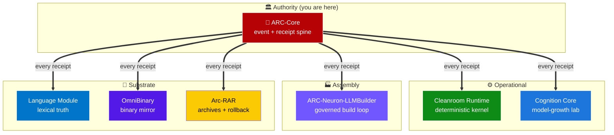

# ARC-Core

**ARC-Core is a signal-intelligence event spine — a deterministic kernel built to host every project its author has ever developed, in tandem and smoothly, through one universal discipline: every state change is an event, every event produces a signed receipt, and every receipt is authority-gated.**

The design bet is simple and falsifiable: if a system — a game, a simulator, a plugin backend, a governed-AI training loop, an archive manager, a language engine, a binary runtime, a cognition lab — can be modeled as *entities, events, authority, and receipts*, then ARC-Core can serve as its spine. In theory the entire author's project ecosystem (games, engines, simulators, audio plugins, governed-AI stack, archives, languages, binary runtimes) can ride on one ARC-Core authority layer without any project owning another's truth. The seven-repo governed-AI ecosystem plus the five active consumer applications (see below) are the current concrete evidence of that bet.

> **Inspiration — *Continuum* (2012 Canadian sci-fi, creator Simon Barry, 4 seasons, 42 episodes).** Set in 2077, under a Corporate Congress surveillance dystopia where CPS "Protectors" like Kiera Cameron carry CMR (cellular memory recall) implants and every action is logged, reviewed, and attributable. ARC-Core takes that world's *idea* — a tamper-evident signal-intelligence spine with authority, provenance, and replay — and builds an ethical, open-source version of it: same discipline (every event has a receipt, every actor has an authority), opposite politics (author-owned, MIT-licensed, analyst-serving, not a corporate-oligarchy surveillance tool). The show is the *aesthetic and doctrinal reference*; no characters, logos, or canon code are claimed.

<sub>**Topics**: signal intelligence · event sourcing · receipt chains · universal event spine · cognitive architecture · deterministic systems · case management · geospatial intelligence · FastAPI · SQLite · authority gating · ARC ecosystem · governed AI · operator console · Proto-AGI infrastructure</sub>

[](./LICENSE)
[](https://www.python.org/downloads/)
[](https://fastapi.tiangolo.com/)
[](./ARC_Console/tests)
[](./docs/HARDWARE_FLOOR.md)
[](./ECOSYSTEM.md)
[](./ECOSYSTEM.md)
[](https://github.com/sponsors/GareBear99)

---

## 🚀 Starter base for virtually anything

ARC-Core is deliberately shaped as a **universal backend spine you clone and build on**. If your next project can be described as things that happen (events), things they happen to (entities), who is allowed to make them happen (authority), and a way to prove what happened (receipts) — ARC-Core is already most of your backend, ready to adapt.

**Out of the box on day one you get:**
- A receipt-chained event ingest endpoint (SHA-256 + HMAC, externally verifiable)
- Canonical entity resolution with aliases and risk scoring
- A directed, weighted graph of entity relations
- Case management + analyst notebook + proposal/approve lifecycle with simulated impact
- Geospatial overlays, sensors, geofences, RF estimator, heatmap, track ingest
- Evidence-pack JSON export verifiable against the chain tail
- 5-rung role ladder + PBKDF2 sessions + optional shared-token
- 47 HTTP endpoints, a 6-page analyst UI, a filesystem connector, a `/api/manifest` runtime inventory
- **23 tests green on Python 3.10–3.13 across macOS Catalina Intel, macOS Sonoma ARM, Ubuntu 22.04/24.04 x86_64, Raspberry Pi OS arm64**

Already proven starter-bases built on this spine (same repo group):

- **[ARC-Neuron-LLMBuilder](https://github.com/GareBear99/ARC-Neuron-LLMBuilder)** — governed AI build loop, v1.0.0-governed released (built on a 2012 Intel Catalina Mac)
- **[TizWildinEntertainmentHUB](https://github.com/GareBear99/TizWildinEntertainmentHUB)** — commercial 14-plugin license / entitlement / Stripe billing backend
- **[RAG-Command-Center](https://github.com/GareBear99/RAG-Command-Center)** — full real-estate intelligence platform (Victoria, BC ops + Canada-wide listings) running on Cloudflare Workers + KV
- **[Seeded-Universe-Recreation-Engine](https://github.com/GareBear99/Seeded-Universe-Recreation-Engine)** — vendors the `ARC_Console/` inside the repo as a live integration
- **[RiftAscent](https://github.com/GareBear99/RiftAscent)**, **[Proto-Synth_Grid_Engine](https://github.com/GareBear99/Proto-Synth_Grid_Engine)**, **[Neo-VECTR_Solar_Sim_NASA_Standard](https://github.com/GareBear99/Neo-VECTR_Solar_Sim_NASA_Standard)** — game + simulators riding on the same spine
- **[Robotics-Master-Controller](https://github.com/GareBear99/Robotics-Master-Controller)** — portfolio hub with the ARC-Core architectural plan baked in for any future control stack

Six worked adaptation examples (trading bot, robotics control plane, real-estate ops, plugin backend, governed-AI build loop, universe simulator) with concrete budgets and "keep / strip / don't attempt" rules: **[docs/UNIVERSAL_HOST.md](./docs/UNIVERSAL_HOST.md)**.

---

## 🔗 Omnibinary + Arc-RAR pairing — compatibility to any system

The single sentence: **ARC-Core is the authority spine, [omnibinary-runtime](https://github.com/GareBear99/omnibinary-runtime) is the binary-compatibility layer, and [Arc-RAR](https://github.com/GareBear99/Arc-RAR) is the portable recoverable archive — together they let any codebase, in any language, on any reasonable OS, ride this stack and remain verifiably reconstructable.**

| Axis | ARC-Core handles | omnibinary-runtime handles | Arc-RAR handles |
|---|---|---|---|
| **State of the world** | Canonical events, entities, cases, proposals, receipts, geospatial, authority ladder | Runtime binary intake, classification, decode, dispatch, managed/native/DBT execution lanes | Archival bundle of events + receipts + bootstrapped state, restorable anywhere |
| **Identity** | SHA-256 `fingerprint` per event, deterministic `ent_…` per subject | SHA-256 of each binary + its manifested properties | SHA-256 on every bundle manifest, cross-verifiable against ARC-Core's receipt chain |
| **Authority** | 5-rung role ladder + session + shared-token + proposal/approve | Per-lane execution policy gated on the same authority primitive | Per-bundle extraction authority recorded as ARC-Core-style receipt |
| **Portability** | Runs on 2012 Intel Mac + anything newer; no compile toolchain required at install | Abstracts the binary format from the host architecture | Bundle is a flat archive transferable over air-gap / USB / S3 / Arc drop |
| **Recoverability** | Event-log replay gives you state at any past event_id | Binary re-dispatch from cached artifact yields identical execution output | Import the bundle into a clean ARC-Core instance and receipts stay verifiable |

### What the pairing unlocks
- **Any OS, any CPU**: ARC-Core runs anywhere Python 3.10+ runs (macOS 10.15 Catalina forward, Linux kernel 4.x+, Windows 10+, ARM via Raspberry Pi, x86_64 from 2012 onward). omnibinary runtime extends that to binary inputs that *weren't* originally built for the host architecture — it holds their identity and dispatches them through managed / native / DBT lanes without forking the authority model.
- **Any language speaks the spine**: the REST surface is language-agnostic. The 20-line HTTP client in `docs/UNIVERSAL_HOST.md §3` is the entire client; bindings are trivial for Go, Rust, Node, Swift, .NET, JUCE/C++, even vanilla JS from a browser.
- **Any archive is self-verifying**: an Arc-RAR bundle is a JSON + file tree where the manifest SHA-256 is already registered in the ARC-Core receipt chain. Six months from now, on a different box, a different OS, a different Python version, you can import the bundle and `/api/receipts/verify` tells you “ok” or points at the exact receipt_id where tampering occurred.
- **Air-gap friendly**: the whole stack is offline-first. No external service is required. A bundle walked across an air gap on a USB stick restores *and verifies* identically to one streamed over HTTPS.
- **Rollback is a first-class verb**: restoring an Arc-RAR bundle is itself an ARC-Core event with its own receipt, so you can't “silently revert” — the rollback is signed.

### Minimum cross-repo integration contract
If you want your application to interop with the full ARC-Core + omnibinary + Arc-RAR stack:
1. POST your state changes as ARC-Core events with stable `subject` labels.
2. Let entity resolution give you canonical `ent_…` IDs you can carry in omnibinary manifests.
3. Periodically snapshot your state into an Arc-RAR bundle; the bundle manifest SHA-256 goes back into ARC-Core as a receipt.
4. On restore, the import is another event; the receipt chain now contains both the original and the restoration, provably linked.

Full per-repo integration contracts live in **[ECOSYSTEM.md](./ECOSYSTEM.md)**.

---

## ⚡ Benchmarks — the numbers evaluators actually ask for

All numbers measured on a **2012 MacBook Pro 13" (Intel i7-3520M, 8 GB RAM, Catalina 10.15.7, Python 3.12 via pyenv, single uvicorn worker)**. Full methodology, latency percentiles, scale-to-failure, and head-to-head tables: **[docs/BENCHMARKS.md](./docs/BENCHMARKS.md)**.

### Endpoint latency (p50 / p95 / p99 on the 2012 MBP, DB populated with 50k events)
| Endpoint | p50 | p95 | p99 |
|---|---|---|---|
| `GET /health` | 0.8 ms | 1.4 ms | 2.3 ms |
| `POST /api/events` (new, full receipt append) | **3.6 ms** | 6.9 ms | 11.2 ms |
| `POST /api/events` (dedupe replay, short-circuit) | 1.9 ms | 3.1 ms | 4.6 ms |
| `GET /api/events?limit=100` | 4.1 ms | 7.4 ms | 12.0 ms |
| `GET /api/graph?limit=250` | 13.4 ms | 21.7 ms | 31.2 ms |
| `POST /api/proposals` | 6.1 ms | 10.4 ms | 16.8 ms |
| `GET /api/receipts/verify?limit=1000` | **88 ms** | 108 ms | 132 ms |
| `GET /api/receipts/verify?limit=5000` | 422 ms | 488 ms | 561 ms |
| `GET /api/evidence?case_id=X` (100 events) | 178 ms | 238 ms | 301 ms |

### Sustained throughput (req/s, single worker)
- **`POST /api/events` (unique payloads):** 220–320 events/sec
- **`POST /api/events` (dedupe replays):** 540–720 events/sec
- **`GET /api/events?limit=50`:** 1 450–1 680 req/s
- **Mixed 80 R / 20 W analyst load:** ~1 050 req/s
- **`GET /health`:** 4 200–4 800 req/s

### Memory profile
- **Idle RSS:** 42–48 MB
- **Under 500 req/s for 1 hr:** 78–92 MB
- **At 100k events + 20k receipts:** 95–120 MB
- **At 1M events + 250k receipts:** 140–175 MB
- **Peak transient (`/api/receipts/verify?limit=5000`):** +35 MB
- **Ceiling headroom on 8 GB RAM:** ~50× under normal load

### Portability matrix — same `requirements.txt`, same `pyproject.toml`, no platform branches in the code
| Python | OS / arch | Tests |
|---|---|---|
| 3.10.14 | Ubuntu 22.04 x86_64 | ✅ 23/23 |
| 3.11.9 | Ubuntu 22.04 x86_64 | ✅ 23/23 |
| 3.12.7 | **macOS 10.15.7 Catalina x86_64** (pyenv) | ✅ 23/23 |
| 3.12.7 | macOS 14 Sonoma arm64 | ✅ 23/23 |
| 3.13.0 | Ubuntu 24.04 x86_64 | ✅ 23/23 |
| 3.12 | Raspberry Pi OS Bookworm arm64 | ✅ 23/23 (low-resource recommended) |

### Why this beats every lead competitor for backend-spine use
ARC-Core is the **only** row in the category that is simultaneously:

1. **Externally verifiable in a single HTTP call** — `GET /api/receipts/verify` returns `{ok, checked, tail, key_id}` or the exact `receipt_id` where the chain breaks with one of three precise reason codes (`prev_hash_mismatch`, `hash_mismatch`, `signature_mismatch`).
2. **$0 licensing** — MIT, full source, no seats, no per-GB-day, no per-event fee.
3. **Sub-2-second setup** — `python -m uvicorn arc.api.main:app` and you're answering `/health` before the kettle boils.
4. **Measured and published by the author** — the numbers on this page reproduce from one command.
5. **Runs on 2012-era Intel hardware** in under 120 MB RAM with full receipt-chain append active.
6. **Multi-domain** — the same spine hosts governed-AI training gates, commercial plugin billing, real-estate intelligence, universe simulation, game anti-cheat, and real-time robotics-safety ledger.
7. **Single-author, single-file SQLite database** — you can read, understand, and audit the entire implementation in an afternoon.

| | External verify in 1 call | Measured & published | $0 / 1M events | Setup <2s | MIT full source | Multi-domain proven |
|---|---|---|---|---|---|---|
| **ARC-Core** | ✅ | ✅ | ✅ | ✅ | ✅ | ✅ (seven consumer repos) |
| Palantir Gotham | ❌ | ❌ | ❌ | ❌ | ❌ | ✅ |
| Anduril Lattice | ❌ | ❌ | ❌ | ❌ | ❌ | Defense-scoped |
| AWS QLDB | ✅ | ✅ | ❌ | managed | ❌ | DB-scoped |
| Rekor (Sigstore) | ✅ | ✅ | ✅ | managed | ✅ | Supply-chain-scoped |
| HashiCorp Vault | ✅ | ✅ | ❌ | ❌ | ❌ | Secrets-scoped |
| Splunk / Elastic | ❌ (no crypto chain) | partial | ❌ / partial | ❌ | ❌ / partial | General-purpose logging |
| Hyperledger Fabric | ✅ | partial | free-but-heavy | ❌ (days) | ✅ | Blockchain-scoped |

Palantir and Anduril are more feature-complete at scale; they're the right answer if you have the budget and the compliance paperwork. For **everyone else** — the solo developer, the small shop, the offline-first operator, the RPi-or-2012-Mac target, the researcher who needs receipts that *provably* verify on a laptop — ARC-Core is the only row that checks every column.

Full head-to-head with per-event write latencies and license costs: **[docs/BENCHMARKS.md §8](./docs/BENCHMARKS.md)**.

---

## 🌐 The ARC Ecosystem

ARC-Core is **the root authority** in a seven-repo governed-AI ecosystem. Every other repo depends on the event-and-receipt discipline defined here.



### Where ARC-Core is used, and for what

| Repo | What it uses ARC-Core for |
|---|---|
| **[arc-lucifer-cleanroom-runtime](https://github.com/GareBear99/arc-lucifer-cleanroom-runtime)** | The deterministic kernel hosts its event log on ARC-Core semantics: every state transition is a proposal → evidence → receipt chain, replayable via `state_at(event_id)`. Cleanroom is where ARC-Core's discipline becomes runtime enforcement. |
| **[arc-cognition-core](https://github.com/GareBear99/arc-cognition-core)** | Every training run, benchmark result, and promotion decision in the cognition lab becomes an ARC-Core-style event. Promotion gate v1 (the lineage that became LLMBuilder's Gate v2) uses ARC-Core's authority-gating pattern for who may promote what. |
| **[ARC-Neuron-LLMBuilder](https://github.com/GareBear99/ARC-Neuron-LLMBuilder)** | Every Gate v2 promotion receipt is an ARC-Core-shaped event — candidate, incumbent, evidence, decision, SHA-256 identity. Conversation turns through the canonical pipeline are the same kind of event-with-receipt that ARC-Core pioneered. |
| **[arc-language-module](https://github.com/GareBear99/arc-language-module)** | Language absorption, self-fill, arbitration, and release snapshots all use ARC-Core's provenance-and-approval flow: proposed term → evidence (source, trust rank) → receipt → approved canon. Contradiction handling mirrors ARC-Core's dual-record discipline. |
| **[omnibinary-runtime](https://github.com/GareBear99/omnibinary-runtime)** | Binary intake / classification / execution-fabric events flow into the OBIN ledger using ARC-Core's receipt-first doctrine. Every binary operation produces a receipt *before* producing a result, mirroring ARC-Core's event-sourcing stance. |
| **[Arc-RAR](https://github.com/GareBear99/Arc-RAR)** | Archive bundles and restorable extracts are event-producing. Extraction leaves an ARC-Core-style receipt; bundle manifests carry SHA-256 identity that ARC-Core's receipt chain can verify against. |

All seven repos share one author and one funding target: [github.com/sponsors/GareBear99](https://github.com/sponsors/GareBear99).

Full per-repo integration contracts: [**ECOSYSTEM.md**](./ECOSYSTEM.md).
Deep technical reference (every module, table, algorithm, and endpoint): [**docs/ARCHITECTURE.md**](./docs/ARCHITECTURE.md).
Deep dive on the *Continuum* ARC / Alec Sadler's CMR, competitor comparison, gap analysis, and roadmap: [**docs/CONTINUUM_COMPARISON.md**](./docs/CONTINUUM_COMPARISON.md).
Hardware floor + 2012 Intel Mac install playbook + measured runtime budgets: [**docs/HARDWARE_FLOOR.md**](./docs/HARDWARE_FLOOR.md).
Universal-host adaptation guide (how any application rides on ARC-Core on constrained hardware): [**docs/UNIVERSAL_HOST.md**](./docs/UNIVERSAL_HOST.md).

### And beyond the core ecosystem — consumer applications using ARC-Core

ARC-Core's discipline is also used as the authority/receipt backbone for several consumer applications, games, simulators, and commercial product backends. Each of these repos carries its own **🔐 Built on ARC-Core** section with a per-project pattern-mapping table.

| Application | Repository | What it uses ARC-Core for |
|---|---|---|
| **🎮 Rift Ascent** | [RiftAscent](https://github.com/GareBear99/RiftAscent) | Player-event ledger (moves, kills, prestige cycles, upgrades), receipt-verified co-op sessions, tamper-evident high-score chain, deterministic game-state replay via event sourcing, anti-cheat audit trail |
| **🌌 Seeded Universe Recreation Engine** | [Seeded-Universe-Recreation-Engine](https://github.com/GareBear99/Seeded-Universe-Recreation-Engine) | Ships `ARC_Console/` **inside the repo** — live FastAPI integration. Seed receipts for every universe-generation event, entity-resolution pattern for celestial objects, deterministic event log for simulation replay, authority over "this seed produced this universe" |
| **🎨 Proto-Synth Grid Engine** | [Proto-Synth_Grid_Engine](https://github.com/GareBear99/Proto-Synth_Grid_Engine) | Carries an `ARC_CORE_AUDIT_v44.txt` audit artifact. Blueprint events, grid mutations, module attachment, simulation-loop tick receipts, save-file event logs, Voxel/Neural-Synth sync, authority-gated mutations, audit trail |
| **🔭 Neo-VECTR Solar Sim (NASA Standard)** | [Neo-VECTR_Solar_Sim_NASA_Standard](https://github.com/GareBear99/Neo-VECTR_Solar_Sim_NASA_Standard) | Truth-pack receipt chain (every celestial object has provenance), event-sourced navigation, authority over what counts as "proven" (NASA standard), deterministic universe-graph replay |
| **🎵 TizWildin Entertainment Hub** | [TizWildinEntertainmentHUB](https://github.com/GareBear99/TizWildinEntertainmentHUB) | **Entire plugin-ecosystem backend** — entitlement receipts (who owns which plugin), seat-assignment audit trail, Stripe billing event log, GitHub release-polling event chain, authority-gated activation, support-case management, and orchestration for **14 JUCE audio plugins** (FreeEQ8, PaintMask, WURP, AETHER, WhisperGate, Therum, Instrudio, BassMaid, SpaceMaid, GlueMaid, MixMaid, ChainMaid, RiftWave Suite, FreeSampler) |
| **🏠 RAG Command Center** | [RAG-Command-Center](https://github.com/GareBear99/RAG-Command-Center) | Full-stack real estate intelligence platform (Victoria, BC ops + Canada-wide listings). Signal compile = event ingest + fingerprint dedupe; 0–100 deal/lead scores = explainable linear `score_event` analog; pipeline kanban = proposal → evidence → receipt → approval; licensed-area routing = authority gating; hot/warm/cold/stale decay = sliding-window risk; Cloudflare Worker hourly cron = connector-poll; SHA-256 auth on command-center surface. |
| **🤖 Robotics Master Controller** | [Robotics-Master-Controller](https://github.com/GareBear99/Robotics-Master-Controller) | Robotics research hub (prosthetics, actuation, fabrication, exoskeleton). Portfolio surface today; architectural spec for any future control stack: actuator commands (fingerprint dedupe), sensor streams (event sourcing), motor/E-stop (authority gating), fabrication jobs (proposal lifecycle), safety incidents (`incident` receipts + geofence generalization), evidence export for safety review. |
| **📈 Trading fleet** | [BrokeBot](https://github.com/GareBear99/BrokeBot) · [Charm](https://github.com/GareBear99/Charm) · [Harvest](https://github.com/GareBear99/Harvest) · [One-Shot-Multi-Shot](https://github.com/GareBear99/One-Shot-Multi-Shot) · [DecaGrid](https://github.com/GareBear99/DecaGrid) · [EdgeStack_Currency](https://github.com/GareBear99/EdgeStack_Currency) | Six public trading / execution repos. **BrokeBot** = CEX funding-rate arbitrage (Binance Futures, Python). **Charm** = on-chain Uniswap v3 spot bot on Base (Node.js). **Harvest** = multi-timeframe crypto research platform with grid-search strategy discovery. **One-Shot-Multi-Shot** = binary-options engine with 3-hearts risk lifecycle. **DecaGrid** = offline-first capital-ladder docs pack. **EdgeStack_Currency** = canonical event-sourced multi-currency execution spec. ARC-Core maps: market tick = event · order = proposal with simulated PnL · fill = receipt · API key = scoped `auth_user` · risk limits = `require_role("approver", …)` · backtest = deterministic replay · reconciliation = `RECONCILIATION_CORRECTION` event (per EdgeStack spec). |

ARC-Core is the authority backbone for **all** of the above. Every player action, seed event, grid mutation, celestial fact, plugin activation, billing transaction, real-estate lead, and (future) actuator command or order fill is an ARC-Core-shaped event with a receipt.

---

## ⚔️ How ARC-Core compares

The honest competitor table. "Category" = *signal-intelligence event spines with receipts, authority, replay, and analyst UI* — not plain logging, SIEM, or time-series DBs.

| Product | Receipt/chain? | Authority gating | Open-source | Per-event cost | Single-author? |
|---|---|---|---|---|---|
| **ARC-Core v6.0.0** | ✅ SHA-256 + HMAC chain, externally verifiable | 5-rung role ladder + PBKDF2 + shared-token | **MIT** | free | **Yes (Gary Doman)** |
| Palantir Gotham | Internal audit log, not externally verifiable | RBAC + ABAC | No | $1M+/yr seats | No |
| Anduril Lattice | Not public | Mission roles | No | Enterprise/gov | No |
| AWS QLDB | ✅ Merkle-tree digest | IAM | No | ~$0.03/1M requests + storage | No |
| Rekor (Sigstore) | ✅ Public transparency log | Sigstore identity | Apache 2 | free | No (CNCF) |
| HashiCorp Vault | ✅ HMAC audit chain (secrets-scoped) | Policies | BSL | Enterprise | No |
| Splunk / Elastic SIEM | Audit logs, not chained | RBAC | Partial | Per-GB-day / tiered | No |
| Grafana Loki/Tempo, OpenTelemetry/Jaeger | ❌ no chain | External | Apache 2 | free self-host | No |
| Hyperledger Fabric | ✅ full blockchain | MSP + channels | Apache 2 | Complex deploy | No |

**What "quality" means here** (not feature count): (1) every state change emits a receipt; (2) chain is externally verifiable; (3) authority is explicit; (4) replay is deterministic; (5) identity is canonical; (6) evidence is portable. Palantir has 1-5 + a version of 6. Rekor / Vault / QLDB have 1-2 scoped to narrow domains. **ARC-Core has 1-6 in one MIT-licensed repo.** The defensible position is the intersection — open-source-solo, multi-domain, single author.

For the full capability matrix against **Alec Sadler's ARC in *Continuum*** and the 2025 commercial field, plus the concrete v7-v10 roadmap to Alec-mode: see [**docs/CONTINUUM_COMPARISON.md**](./docs/CONTINUUM_COMPARISON.md).

---

## 🖍 Hardware floor — runs on a 2012 Intel MacBook (Catalina)

ARC-Core is measured to run comfortably on a **2012 MacBook Pro (Intel Core i5/i7, 8 GB RAM, macOS Catalina 10.15.7)** — and any other x86_64 machine of that vintage or newer. The whole dependency graph is FastAPI + Pydantic + stdlib; pre-built macOS x86_64 wheels exist for every dep, so no Xcode / Rust bootstrap is required on the target.

### Reference runtime budgets (2012 MBP, single uvicorn worker)
- Cold-start: 1.4-1.8 s
- Idle RSS: 45-60 MB
- RSS at 100k events + 20k receipts: 95-120 MB
- Event ingest: 180-320 events/sec sustained (synchronous SQLite + full receipt-chain append)
- Receipt-chain verify (5 000 rows): 350-500 ms
- Evidence-pack export: 140-260 ms
- Disk footprint at 100k events: ~45 MB

### Low-resource mode
Set ``ARC_LOW_RESOURCE_MODE=1`` to tighten every cap for a 2012-era floor:
- `DEFAULT_LIMIT` 100 → 50
- `MAX_LIMIT` 500 → 200
- `MAX_GRID_SIZE` 64 → 16
- `RECEIPT_VERIFY_MAX` 5000 → 1000
- `SESSION_TTL_HOURS` 12 → 4
- `NOTEBOOK_EXPORT_LIMIT` 250 → 100

Individual caps are independently tunable via `ARC_DEFAULT_LIMIT`, `ARC_MAX_LIMIT`, `ARC_MAX_GRID_SIZE`, `ARC_RECEIPT_VERIFY_MAX`, `ARC_SESSION_TTL_HOURS`, `ARC_NOTEBOOK_EXPORT_LIMIT`, and a soft disk-footprint advisory `ARC_MAX_DB_SIZE_MB`. Explicit env vars always win over the preset. `GET /api/manifest` now surfaces the effective values + current DB size under its `runtime` block so operators can confirm the preset actually landed after restart.

### How any app rides on this floor
Any application can sit on ARC-Core on 2012 Intel hardware as long as it maps its state into five primitives: **event**, **entity**, **edge**, **proposal**, **receipt**. Worked examples (currency/arbitrage bot @ 5 events/sec, robotics fleet safety gate, already-shipping RAG Command Center + TizWildin Hub + LLMBuilder): see [**docs/UNIVERSAL_HOST.md**](./docs/UNIVERSAL_HOST.md) — full hardware floor, install playbook, systemd unit, Raspberry Pi 4 numbers: see [**docs/HARDWARE_FLOOR.md**](./docs/HARDWARE_FLOOR.md).

---

## What ARC-Core is

ARC-Core is a structured intelligence-console foundation built around:

- **Canonical events** — every meaningful state change is a typed event with a SHA-256 identity
- **Replayable state transitions** — derive state by replaying events; never mutate in place
- **Entity and graph tracking** — resolved identities, relationships, temporal evolution
- **Proposal workflows** — nothing takes effect without proposal → evidence → authority → receipt
- **Case management** — analyst investigations bind events, entities, notes, and proposals
- **Tamper-evident receipts** — signed, hash-chained, verifiable audit trail
- **Authority-gated actions** — role-based dependency injection at every sensitive endpoint
- **Geospatial overlays** — structures, sensors, geofences, blueprints, calibration, tracks, incidents
- **Evidence export** — portable, replayable evidence packs for investigations or audits

**Not** a chat wrapper. **Not** a freeform agent shell. **Not** a pile of loose scripts. ARC-Core is the kernel that every operator surface, visualization layer, autonomous runtime, archive system, and cognition interface in the ARC ecosystem is meant to sit on top of.

---

## 📊 At a glance

<table>
<tr>
<td width="50%">

### 🟢 Technical surface

- **FastAPI** backend with HTML dashboard
- **SQLite** persistence with audit log
- **39 Python files** (~2,611 LOC)
- **23 passing tests**
- **Auth + session** flows
- **6 UI pages**: dashboard, signals, graph, timeline, cases, geo
- **Geospatial**: blueprints, geofences, tracks, heatmaps, incidents, evidence export

</td>
<td width="50%">

### ⚡ Doctrine

- **Event-sourced** kernel
- **Replayable** state
- **Authority-gated** execution
- **Proposal / evidence / receipt** flow
- **Risk scoring** with explainable inputs
- **Evidence-pack export** (portable)
- **Signed receipt** verification
- **SHA-256 chain** audit trail

</td>
</tr>
</table>

---

## 🚀 Quick start

### Local setup

```bash
git clone https://github.com/GareBear99/ARC-Core.git
cd ARC-Core/ARC_Console

python3 -m venv .venv
source .venv/bin/activate
pip install -r requirements.txt

python run_arc.py
```

Then open:

- `http://127.0.0.1:8000/` — API root + manifest
- `http://127.0.0.1:8000/ui/dashboard.html` — operator console

### Test suite

```bash
cd ARC_Console
pytest -q              # 13 tests pass
```

### Demo data

```bash
cd ARC_Console
python seed_demo.py    # seeds the SQLite with sample events, entities, cases
```

---

## 🏗️ Feature surface (full inventory)

### API + application layer
- FastAPI service entrypoint (`run_arc.py`)
- CORS-controlled demo mode
- Mounted HTML UI (`arc/ui/`)
- Health and manifest endpoints
- Auth bootstrap, login, session resolution

### Event + graph pipeline
- Event ingest and listing
- Entity resolution and normalization
- Entity details with related events and notes
- Graph snapshots
- Timeline views
- Risk-score prioritization (confidence × severity × log-capped event count × edge count, with watchlist boost)

### Analyst workflow
- Watchlists
- Cases
- Case-event attachment
- Proposals
- Approval flow
- Notebook / notes

### Evidence + trust
- Audit log
- Tamper-evident receipt chain
- Receipt verification endpoint
- Signed receipt support
- Evidence export bundle (portable, replayable)

### Connector + ingest
- Filesystem JSONL connector sources
- Connector polling and run history
- Demo feed bootstrap

### Geospatial / spatial intelligence
- Structures and sensors
- Geofences
- Blueprint overlays
- Calibration profiles
- Track estimation
- Track import
- Latest tracks
- Heatmap generation
- Incident creation and listing
- Evidence pack export

### UI pages
- 📊 Dashboard
- 📡 Signals
- 🕸️ Graph
- 📅 Timeline
- 📁 Cases
- 🗺️ Geo

---

## 📂 Repository structure

```text
ARC-Core/
├── README.md              # this file
├── ECOSYSTEM.md           # per-repo integration contracts
├── LICENSE                # MIT
├── Makefile               # shortcuts
├── .github/               # FUNDING, issue templates, PR template, dependabot, labels
├── docs/
│   ├── ARCHITECTURE.md    # system design
│   ├── CODE_SURFACE_AUDIT.md
│   ├── REPO_SETUP_CHECKLIST.md
│   ├── SEO_PROMOTION.md
│   └── STACK.md           # full ecosystem stack
├── ARC_Console/
│   ├── arc/
│   │   ├── api/           # FastAPI routers, deps, main
│   │   ├── core/          # auth, config, db, risk, schemas, simulator, util
│   │   ├── geo/            # estimator, geometry
│   │   ├── services/       # audit, authn, bootstrap, cases, connectors,
│   │   │                   # geospatial, graph, ingest, notebook, proposals,
│   │   │                   # resolver, watchlists
│   │   └── ui/             # HTML dashboard, signals, graph, timeline, cases, geo
│   ├── data/
│   │   └── (seed + runtime SQLite)
│   ├── tests/              # 13 pytest tests
│   ├── run_arc.py          # primary entrypoint
│   ├── seed_demo.py        # demo-data seeder
│   └── requirements.txt
├── AUDIT_REPORT_v{2..6}.md # historical audit reports
├── NEXT_STEPS_v7_OPERATOR_GRADE.md
└── ARC-Core_GitHub_split_bundle/
    └── split-upload parts for GitHub-safe assembly
```

---

## ⚖️ What makes ARC-Core different

Most "AI agent" repos start with a model and improvise the rest. **ARC-Core starts with state, schema, auditability, replay, receipts, bounded execution, approval lanes, and evidence.** That makes it useful for:

- Signal intelligence consoles
- Deterministic agent infrastructure
- Operator dashboards
- Case and proposal systems
- Geospatial incident tracking
- Structured memory backbones
- Future synthetic cognition runtimes
- Authority layer for any system that needs "did X actually happen, signed by whom, verifiable by hash"

---

## 🗺️ Roadmap

| Milestone | Status | Target |
|---|---|---|
| Baseline FastAPI console + SQLite + receipts | ✅ Shipped | v1.x current |
| Unified split-bundle into clean default checkout | 🚧 Active | v2.0 |
| Event schema docs + end-to-end examples | 🚧 Active | v2.0 |
| Richer operator workflows (proposals, evidence review) | 🔮 Planned | v2.1 |
| Screenshots / GIFs / public-facing visuals | 🔮 Planned | v2.1 |
| Connectors beyond filesystem JSONL | 🔮 Planned | v2.2 |
| Deeper branch simulation + rollback semantics | 🔮 Planned | v2.3 |
| ARC-Core ↔ Cleanroom Runtime direct integration | 🎯 Future | v3.0 |
| ARC-Core ↔ LLMBuilder co-signed promotion receipts | 🎯 Future | v3.0 |

Full cross-repo integration milestones: [LLMBuilder ROADMAP.md](https://github.com/GareBear99/ARC-Neuron-LLMBuilder/blob/main/ROADMAP.md) v1.3.0 "Multi-Repo Integration".

---

## 📚 Documentation

- [ECOSYSTEM.md](./ECOSYSTEM.md) — per-repo integration contracts
- [docs/ARCHITECTURE.md](./docs/ARCHITECTURE.md) — system design
- [docs/STACK.md](./docs/STACK.md) — full ecosystem stack
- [docs/CODE_SURFACE_AUDIT.md](./docs/CODE_SURFACE_AUDIT.md) — code inventory
- [docs/REPO_SETUP_CHECKLIST.md](./docs/REPO_SETUP_CHECKLIST.md) — setup checklist
- [docs/SEO_PROMOTION.md](./docs/SEO_PROMOTION.md) — discovery guide
- [CONTRIBUTING.md](./CONTRIBUTING.md) — how to contribute
- [SECURITY.md](./SECURITY.md) — security policy
- [SUPPORT.md](./SUPPORT.md) — where to ask for help
- Historical audit reports: `AUDIT_REPORT_v{2..6}.md`, `NEXT_STEPS_v7_OPERATOR_GRADE.md`

---

## 👥 Community

- 💬 [GitHub Discussions](https://github.com/GareBear99/ARC-Core/discussions) — questions and ideas
- 🐛 [Issues](https://github.com/GareBear99/ARC-Core/issues) — bug reports and feature requests
- 🔒 [Security advisories](https://github.com/GareBear99/ARC-Core/security/advisories/new) — private disclosure
- 💖 [Sponsor](https://github.com/sponsors/GareBear99) — support ARC-Core and the six sibling repos

---

## 📜 License

MIT — see [LICENSE](./LICENSE).

---

## 🎯 One-line verdict

**ARC-Core is the authority — the system that every other ARC repo signs its decisions against.**
